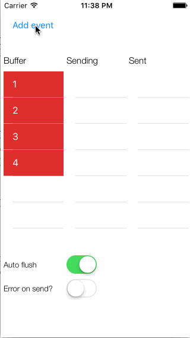

# SendBuffer

This class acts as a FIFO queue with a producer-consumer together with a write-buffer pattern.

It’s a producer-consumer because:

  - You can have several processes (threads, queues, whatever) creating and adding items to the queue. These are the producers.
  - You have one process removing items from the queue and sending them to the server. This is the consumer.
  - Whe the consumer runs asynchronously. While it’s in progress, the producers can still add new items to the queue.

And it’s a write-buffer because:

  - The buffer (or queue) can be filled. There’s size that represent the capacity of the buffer.
  - When the buffer is full, it’s flushed. Those items are “written” (i.e. submitted to the server).
  - When the flush is successfully completed, the items processed are discarded. If there’s an error processing the items, they are added back to the buffer (and they will be processed again later).

The SendBuffer class is useful for several scenarios:

  - If you need to upload items in a background process, but you want to do it in batches (instead of one by one). The typical case is when you need to sent tracking events or pictures to a server.
  - If you need a typical producer-consumer pattern, just create the SendBuffer with size 1. As soon as one item is added to the buffer, it will be processed. The buffer will continue processing items while it has items.

Also you can find a sample application that shows graphically how the buffer behaves.
Next you can see how items are moved from the buffer to the “sending area” and then moved to the “sent area” or moved back to the buffer in case of error

